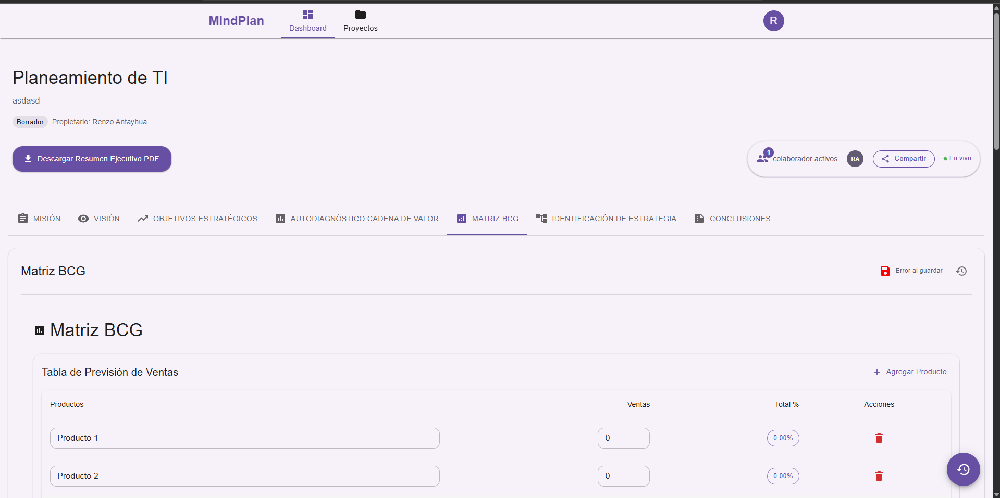
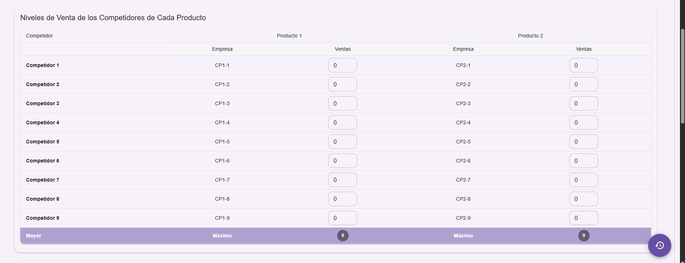
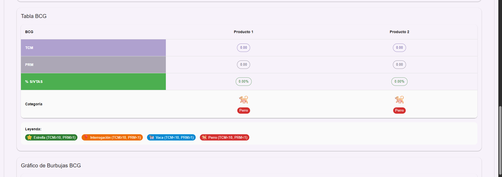
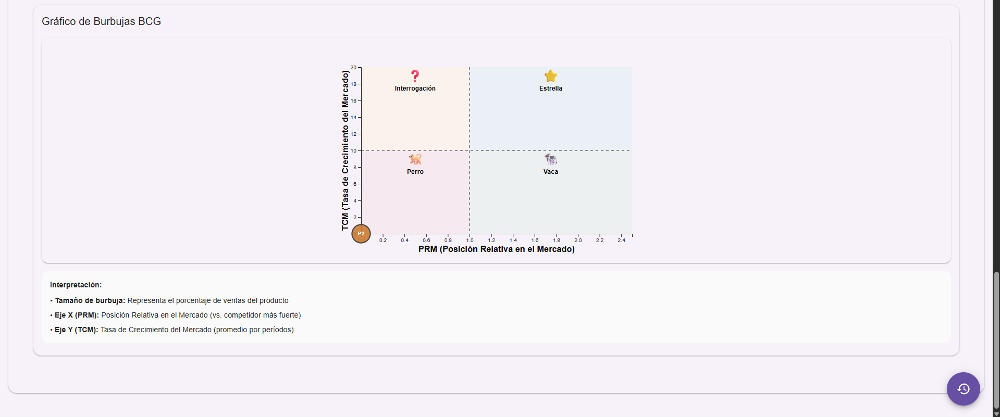

# 🧠 MindPlan — Sistema Colaborativo de Planeamiento Estratégico de TI

MindPlan es una plataforma colaborativa para gestionar el planeamiento estratégico de TI con edición en tiempo real, exportación a PDF, y componentes visuales modernos.

Link de la Repositorio : [Repositorio Github](https://github.com/RenzoAntayhua/PE_II_EXAMEN_PRACTICO)


## 🆕 Cambios recientes
- 🐳 Dockerización completa con Docker Compose: `frontend` (Vite), `backend` (Express) y `mongo`.
- 🔐 CORS y Socket.IO configurados para `http://localhost:5173` vía `FRONTEND_URL` y `VITE_DEV_URL`.
- 🔁 Instalación reproducible en contenedores con `npm ci` y lock files.
- 📊 Nueva sección de Matriz BCG con visualización usando `d3` (dependencia agregada al frontend).
- 🧾 Notas PDF: Puppeteer no descarga Chromium por defecto para reducir el tamaño de la imagen.

## 🚀 Ejecutar con Docker
Requisitos: tener Docker Desktop instalado y corriendo.

1) En la raíz del proyecto, construir y levantar servicios:
```
docker compose up --build
```
2) Abrir la aplicación:
- Frontend (Vite): `http://localhost:5173/`
- Backend (API): `http://localhost:5000/`
- MongoDB: `mongodb://localhost:27017` (DB `mindplan`)

Comandos útiles:
- Detener: `docker compose down`
- Levantar en segundo plano: `docker compose up -d`
- Logs backend: `docker compose logs backend -f`
- Logs frontend: `docker compose logs frontend -f`

## ⚙️ Servicios y puertos
- `mongo` → puerto `27017`, volumen persistente `mongo-data`.
- `backend` → puerto `5000`.
- `frontend` → puerto `5173`.

## 🔧 Variables de entorno (ya definidas en Compose)
Backend:
- `PORT=5000`
- `MONGODB_URI=mongodb://mongo:27017/mindplan`
- `JWT_SECRET=secret`
- `FRONTEND_URL=http://localhost:5173`
- `VITE_DEV_URL=http://localhost:5173`

Frontend:
- `VITE_PROXY_TARGET=http://backend:5000` (proxy `/api` del dev server)
- `VITE_BACKEND_URL=http://localhost:5000`
- `VITE_API_URL=http://localhost:5000`

## ✅ Verificación de dependencias
- Se reconstruyeron las imágenes con `npm ci` y se instalaron dependencias según `package-lock.json`.
- Se detectó y solucionó un error de frontend por dependencia faltante (`d3`). Se agregó al `package.json`, se actualizó el lock y el servidor Vite arrancó correctamente en `http://localhost:5173/`.
- Para asegurar imágenes base actualizadas: `docker compose build --pull`.

## 📝 Notas sobre PDFs (Puppeteer)
La imagen de backend establece `PUPPETEER_SKIP_DOWNLOAD=1` para reducir tamaño. Si necesitas exportación PDF con Chromium integrado:
1) Edita `backend/Dockerfile` y elimina `ENV PUPPETEER_SKIP_DOWNLOAD=1`.
2) Reconstruye: `docker compose up --build`.

## 📚 Stack principal
- Frontend: React, Vite, Material UI, Tailwind, Socket.IO Client, Axios, `d3`.
- Backend: Node.js, Express, Mongoose, Socket.IO, JWT, Puppeteer, Handlebars.
- Infra: Docker Compose, MongoDB.

## 🤝 Contribución
- PRs y mejoras bienvenidas. Ejecuta `docker compose up --build` para mantener coherencia con el entorno.

## 📄 Licencia
Este proyecto está bajo la Licencia Apache 2.0. Ver `LICENSE`.

## 📷 Imágenes de Cambios







